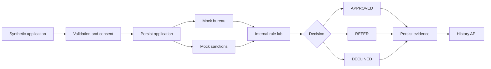

# Retail Banking Origination Lab

A synthetic Java and Spring Boot portfolio platform demonstrating explainable retail-banking origination for home loans, credit cards, savings accounts, and debit cards.

> **Learning boundary:** This repository is not a production lending, KYC, AML, sanctions, PEP, or credit-bureau system. It uses synthetic data, mock integrations, and laboratory rules. It must not be used for real financial decisions.

## Capability journey

```text
VERSION DIMENSION
v0.1  Capture -> Verify -> Assess -> Decide -> Explain
v0.2  Capture -> Persist -> Assess -> Persist Decision -> Retrieve Evidence
v0.3  Planned: Product-specific policy strategies
v0.4  Planned: Governed onboarding and referral workflow
v1.0  Planned: Integrated portfolio baseline
```

## Two-dimensional capability map

```text
                                      DECISION LIFECYCLE
                           CAPTURE  VERIFY  ASSESS  DECIDE  EVIDENCE
PRODUCT DIMENSION
Home loan                    [X]      [X]     [X]     [X]      [X]
Credit card                  [X]      [X]     [X]     [X]      [X]
Savings account              [X]      [X]     [ ]     [X]      [X]
Debit card                   [X]      [X]     [ ]     [X]      [X]

VERSION DIMENSION
v0.1 Decision logic           [X]      [X]     [X]     [X]      [X]
v0.2 Persistence             [X]      [X]     [X]     [X]      [X]
v0.3 Product policy          [ ]      [ ]     [ ]     [ ]      [ ]
v0.4 Workflow governance     [ ]      [ ]     [ ]     [ ]      [ ]

METAFIELDS
Purpose      : Synthetic retail-banking origination learning platform
Input        : Synthetic applicant, product, consent, and affordability data
Process      : Validation, mock screening, rule evaluation, persistence
Decision     : APPROVED, REFER, or DECLINED
Evidence     : Score, sanctions indicator, disposable income, reason codes
Traceability : Application ID, rule-set version, created and decision timestamps
Control      : Protected traits excluded; referrals support human review
Boundary     : Portfolio and learning use only
```

## Version 0.1

Version 0.1 introduced the runnable decision engine:

- Four product identifiers
- REST application submission
- Explicit mock bureau-consent validation
- Deterministic synthetic bureau scoring
- Synthetic sanctions screening
- Disposable-income calculation
- Explainable `APPROVED`, `REFER`, and `DECLINED` results
- Decision reason codes

## Version 0.2

Version 0.2 added persistent decision evidence during the active H2 session:

- `ApplicationEntity` and `DecisionEntity`
- Spring Data JPA repositories
- Rule-set version `0.2.0`
- Application and decision timestamps
- Retrieve one application and its decision
- List stored applications
- Automated persistence-flow test

> H2 remains in memory. Data is removed when the application stops.

## Architecture flow



## Technology stack

- Java 21
- Spring Boot 4.1.1
- Spring Web and Jakarta Validation
- Spring Data JPA and Hibernate
- H2 in-memory database
- Maven and JUnit

## API endpoints

| Method | Endpoint | Purpose |
|---|---|---|
| `POST` | `/api/v1/applications` | Submit a synthetic application and decision it |
| `GET` | `/api/v1/applications/{applicationId}` | Retrieve one application and its decision evidence |
| `GET` | `/api/v1/applications` | List applications stored in the active session |

See [API documentation](docs/API.md) for request and response fields.

## Run locally

```powershell
mvn clean test
mvn spring-boot:run
```

The API listens on `http://localhost:8090`.

## Documentation map

- [Architecture and two-dimensional system view](docs/ARCHITECTURE.md)
- [API and data-contract view](docs/API.md)
- [Governance and control view](docs/GOVERNANCE.md)
- [Version 0.1 baseline](docs/VERSION-0.1.md)
- [Version 0.2 increment](docs/VERSION-0.2.md)
- [Test evidence](docs/TEST-EVIDENCE.md)
- [Roadmap](docs/ROADMAP.md)
- [Changelog](CHANGELOG.md)
- [Security policy](SECURITY.md)

## Responsible-use guardrails

- No real customer, bureau, sanctions, PEP, or production data is included.
- Protected characteristics are not used in scoring.
- Laboratory decisions are synthetic, explainable, and contestable.
- Ambiguous non-sanctions outcomes are referred for human review.
- Build output under `target/` is excluded from Git.

## License

MIT License. See [LICENSE](LICENSE).