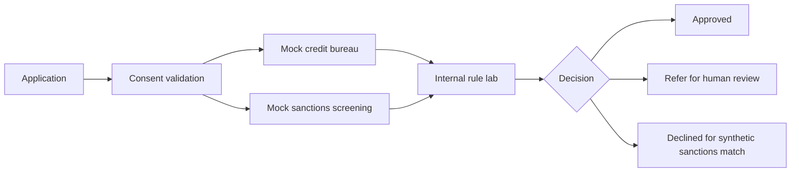

# Retail Banking Origination Lab

A synthetic Java/Spring Boot portfolio project modelling customer onboarding and initial decisioning for home loans, credit cards, savings accounts, and debit cards.

> Learning only. This is not a production lending, sanctions, KYC, AML, or credit-bureau system. It uses synthetic data and deliberately simplified rules. Do not use it to make real financial decisions.

## Two-dimensional architecture

```text
                              DECISION LIFECYCLE
                 CAPTURE   VERIFY   ASSESS   DECIDE   EVIDENCE
PRODUCT
Home loan          [X]       [X]      [X]      [X]       [X]
Credit card        [X]       [X]      [X]      [X]       [X]
Savings            [X]       [X]      [ ]      [X]       [X]
Debit card         [X]       [X]      [ ]      [X]       [X]

METAFIELDS
Purpose  : Mock retail banking origination
Input    : Synthetic applicant and affordability data
Process  : Consent, bureau mock, sanctions mock, internal rules
Decision : Approved, Refer, Declined
Evidence : Score, disposable income, reasons
Control  : No protected traits; human review for referrals
Boundary : Learning and portfolio use only
```

## Flow



## Run

```powershell
mvn clean test
mvn spring-boot:run
```

## Example request

```powershell
$Body = @{
 applicantRef = "SYNTH-1001"
 productType = "CREDIT_CARD"
 monthlyIncome = 45000
 monthlyExpenses = 18000
 existingDebt = 5000
 requestedAmount = 75000
 creditBureauConsent = $true
 fullName = "DEMO CUSTOMER"
 countryCode = "ZA"
} | ConvertTo-Json

Invoke-RestMethod -Method Post -Uri "http://localhost:8090/api/v1/applications" -ContentType "application/json" -Body $Body
```

## Planned modules

1. Customer/KYC onboarding
2. Product eligibility by product type
3. Mock bureau and take-up simulation
4. Synthetic sanctions and PEP screening
5. Internal credit rule lab with versioned rules
6. Decision explainability and manual referral
7. Audit trail and consent evidence
8. PostgreSQL profile, Docker, OpenAPI and tests

## Fairness guardrails

- Do not use age, race, gender, religion, disability, location proxies, or other protected attributes in scoring.
- Keep the scoring rules synthetic and explainable.
- Route ambiguous outcomes to human review.
- Record rule version and reason codes.
