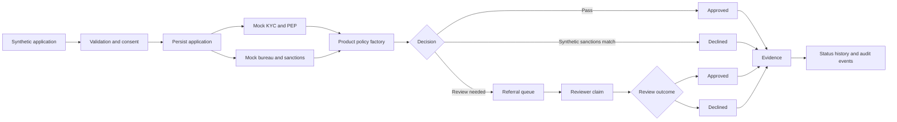

# Retail Banking Origination Lab

A synthetic Java and Spring Boot portfolio platform demonstrating explainable retail-banking origination, product-specific decision policies, persistent decision evidence, synthetic screening states, referral management, reviewer workflow, status history, and audit events.

> **Learning boundary:** This is not a production lending, KYC, AML, sanctions, PEP, credit-bureau, or account-opening system. All customers, reviewers, screening outcomes, rules, and decisions are synthetic. Do not use this software for real financial or compliance decisions.

## Release journey

```text
v0.1.0  Explainable decision engine
   |
   v
v0.2.0  Persistent application and decision evidence
   |
   v
v0.2.1  Architecture, governance, API and test documentation
   |
   v
v0.3.0  Product Policy Strategy Pattern
   |
   v
v0.4.0  Governed referral and reviewer workflow
   |
   v
v0.4.1  Documentation alignment for the complete v0.4 capability
```

## Two-dimensional enterprise capability map

```text
                                             LIFECYCLE DIMENSION
CAPABILITY DIMENSION       CAPTURE  SCREEN  POLICY  DECIDE  PERSIST  REFER  REVIEW  AUDIT
Product application          [X]      [ ]     [X]     [X]      [X]     [ ]     [ ]     [X]
Synthetic KYC/PEP            [X]      [X]     [ ]     [X]      [X]     [X]     [X]     [X]
Credit and affordability     [X]      [X]     [X]     [X]      [X]     [X]     [X]     [X]
Referral queue               [ ]      [ ]     [ ]     [ ]      [X]     [X]     [X]     [X]
Reviewer workflow            [ ]      [ ]     [ ]     [ ]      [X]     [X]     [X]     [X]
Status history               [X]      [X]     [ ]     [X]      [X]     [X]     [X]     [X]
Audit events                 [X]      [X]     [X]     [X]      [X]     [X]     [X]     [X]

METAFIELDS
Purpose      : Demonstrate governed retail-banking origination architecture
Products     : Home loan, credit card, savings account, debit card
Input        : Synthetic applicant, consent, affordability and product data
Screening    : Mock bureau, sanctions, KYC and PEP indicators
Policy       : ProductPolicy Strategy Pattern
Decision     : APPROVED, REFER or DECLINED
Workflow     : Open referral, claim, approve or decline
Evidence     : Reason codes, policy version, states, history and audit events
Persistence  : H2 in-memory database for the active process
Traceability : UUID, actor, source and timestamps
Boundary     : Portfolio learning only; no operational decision use
```

## Implemented capabilities

### Origination and decisioning

- Product applications for home loans, credit cards, savings accounts and debit cards
- Jakarta request validation and explicit synthetic bureau-consent gate
- Deterministic mock bureau scoring and synthetic sanctions screening
- Product-specific policies selected through `ProductPolicyFactory`
- Explainable `APPROVED`, `REFER`, and `DECLINED` results with reason codes

### Persistence and evidence

- Application and decision entities
- Rule or policy version recorded with the decision
- Application and decision timestamps
- Retrieval of one application or all applications in the active H2 session

### Governed workflow

- Synthetic KYC and PEP states
- Open referral queue
- Reviewer claim requirement
- Reviewer approval or decline
- Application status history
- Timestamped audit events with actor and detail

## Architecture flow



## Technology stack

Java 21, Spring Boot 4.1.1, Spring Web, Jakarta Validation, Spring Data JPA, Hibernate, H2, Maven, and JUnit.

## API summary

| Area | Method | Endpoint |
|---|---|---|
| Origination | `POST` | `/api/v1/applications` |
| Evidence | `GET` | `/api/v1/applications/{applicationId}` |
| Evidence | `GET` | `/api/v1/applications` |
| Referral queue | `GET` | `/api/v1/workflow/referrals` |
| Claim | `POST` | `/api/v1/workflow/referrals/{applicationId}/claim` |
| Review | `POST` | `/api/v1/workflow/referrals/{applicationId}/review` |
| Workflow evidence | `GET` | `/api/v1/workflow/applications/{applicationId}` |

## Run locally

```powershell
mvn clean test
mvn spring-boot:run
```

The local API listens on `http://localhost:8090`.

## Documentation

- [Architecture](docs/ARCHITECTURE.md)
- [API](docs/API.md)
- [Governance](docs/GOVERNANCE.md)
- [Workflow](docs/WORKFLOW.md)
- [Test evidence](docs/TEST-EVIDENCE.md)
- [Roadmap](docs/ROADMAP.md)
- [Version 0.1](docs/VERSION-0.1.md)
- [Version 0.2](docs/VERSION-0.2.md)
- [Version 0.3](docs/VERSION-0.3.md)
- [Version 0.4](docs/VERSION-0.4.md)
- [Changelog](CHANGELOG.md)
- [Security](SECURITY.md)

## Current limitations

- H2 data is removed when the application stops.
- KYC, PEP, sanctions and bureau services are mocks.
- No authentication, authorization, concurrency control, reviewer segregation, external rule engine, messaging, observability stack or production deployment exists.
- Reviewer names and review notes are synthetic portfolio inputs.